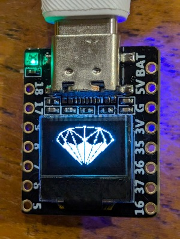
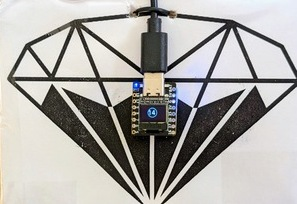
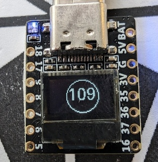

# The Pawn Shop Trinket

## Introduction

Getting in to [The Pawn Shop](https://thepawnshopsf.com/) Speakeasy in San Francisco requires a trinket to exchange, and this is the trinket I made.

This project is a simple Arduino sketch that interacts with a tiny OLED screen and
an LED, displaying messages and scanning for Bluetooth Low Energy (BLE)
devices. It shows a graphic, a screenful of text, and then a bouncing ball of BLE device count.  
It was inspired by Blatano <https://github.com/leighklotz/blatano> 

## Dependencies
- Arduino IDE / ESP32S3 Dev Module core
- Libraries:
  - `WS2812FX` for LED control
  - `U8g2lib` for OLED display

## Setup
1. Ensure you have the required libraries installed in the Arduino IDE.
2. Connect your hardware (OLED screen and LED strip) to the appropriate pins on your Arduino board as specified in the code.
3. Upload the sketch to your Arduino board.

### Board Configuration
- **LED Pin**: 39
- **SDA Pin**: 41
- **SCL Pin**: 40

## Usage
Upon running the sketch, the device will perform the following:
- Initialize the LED and OLED display.
- Display a welcome message on the OLED screen and turn the LED to blue.
- Scan for BLE devices and display the number of devices found in the center of the OLED screen, along with a circle around the text.
- The LED color changes to different colors (red, blue, magenta) depending on the operation.
- Divide by two to estimate occupancy, since everybody has a phone and a watch.

### BLE Scan
The sketch will periodically scan for BLE devices and display the number of devices found. The scanning is initiated every loop iteration and lasts for 5 seconds.

## References
- <https://github.com/01Space/ESP32-S3-0.42OLED>
- <https://github.com/olikraus/u8g2/>
- <https://usa-m.banggood.com/ESP32-S3-0_42-Inch-OLED-Development-Board-ESP-32-RISC-V-WiFi-Bluetooth-For-Arduin-Micropython-p-1978776.html> etc
- The Pawn Shop, SF: <https://www.forbes.com/sites/chelseadavis/2019/02/25/the-pawn-shop-a-secret-tapas-bar-in-san-franciscos-soma-neighborhood/>
- https://thepawnshopsf.com

## Contributing
Contributions are welcome! If you have any ideas, fixes, or improvements, please open an issue or submit a pull request.

## License
This project is licensed under the MIT License - see the LICENSE file for details.

